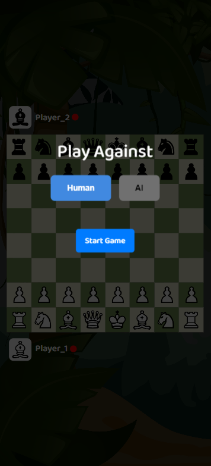
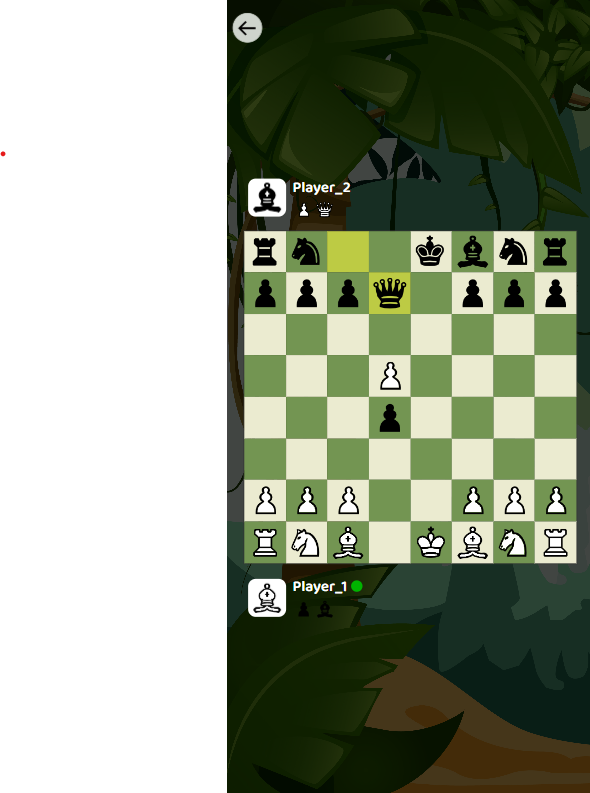

[Visit Linkedin](https://www.linkedin.com/in/piyush-garg-35066919a/)

# Chess_Multiplayer
(HTML5, CSS & JS,Photon Server)
Chess is a two-player strategy game that can be implemented using the Photon Server for seamless real-time multiplayer functionality. Photon ensures 100% accuracy in move synchronization, offering low-latency gameplay and reliable communication between players. It supports cross-platform play, making it ideal for competitive online chess matches.

## Features
- **MultiPlayer**: Users interactions and real-time communication.
- **AI**: Real user gameplay against a computer player.

## Installation
1. Clone the repository:
    ```bash
    git clone https://github.com/piyushgarg322230/Chess_Multiplayer.git
    ```
2. Open the project .
3. Run the Browser.

## Usage
- Users interactions and real-time communication using Photon Realtime server.
- Real user gameplay against a computer play.

## Demo
Web Application is available 
[Live Demo](https://piyushgarg322230.github.io/Chess_Multiplayer/)

## Screen Recording



## Contributing
Pull requests are welcome. For significant changes, please open an issue first to discuss what you would like to change.

## Contact
For any questions or feedback, please contact [Piyush Garg](mailto:piyushgarg322230@gmail.com)
